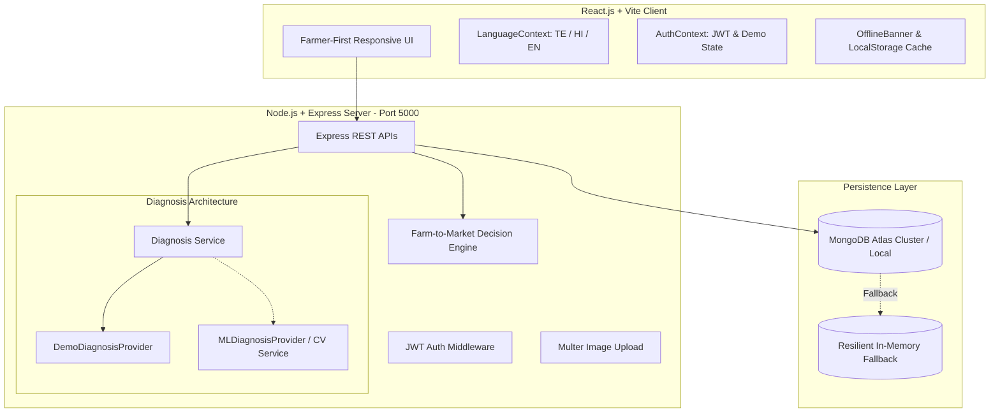

# AGRIHUB - Architecture and Technical Design

## 1. High-Level Architecture



## 2. Technology Stack
- **Frontend Framework:** React 18, Vite 5, React Router v6.
- **Styling & UI:** Responsive CSS, Material UI icons, Bootstrap utility classes, Inter typography.
- **State & Caching:** React Context, LocalStorage / IndexedDB for offline drafts and diagnoses.
- **Backend Runtime:** Node.js v23, Express.js 4.
- **Data Persistence:** MongoDB 8, Mongoose ODM with resilient connection pooling.
- **File Uploads:** Multer with strict image MIME validation (JPEG, PNG, WEBP) and 10MB size cap.
- **Authentication:** JSON Web Tokens (JWT) + bcryptjs salted hashing.

## 3. Diagnosis Provider Pattern
To adhere strictly to hackathon guidelines and prevent fabricated claims of scientific model accuracy:
```
DiagnosisProvider (Abstract Base)
  ├── DemoDiagnosisProvider (Pre-programmed agronomic knowledge with clear demo disclaimer)
  └── MLDiagnosisProvider (Pluggable interface for TensorFlow / ONNX / FastAPI microservices)
```
The frontend interacts exclusively with `POST /api/diagnosis` regardless of which underlying provider is active.

## 4. Offline Resilience Architecture
- `navigator.onLine` listener powers `<OfflineBanner />`.
- Selling drafts are saved to `localStorage.agrihub_selling_draft` on every keystroke.
- Queued actions during network outages are posted to `POST /api/sync/queue` upon reconnect.
